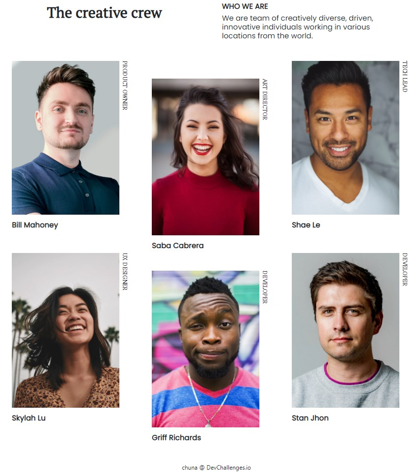

<!-- Please update value in the {}  -->

<h1 align="center">My team page Challenge</h1>

   Solution for a challenge from  <a href="http://devchallenges.io" target="_blank">Devchallenges.io</a>.

  <h3>
    <a href="https://chuna.tech/devchallenges/My_team_page/">
      Demo
    </a>
     | 
    <a href="https://github.com/chunao/devchallenges-my_team_page">
      Solution
    </a>
     | 
    <a href="https://devchallenges.io/challenges/hhmesazsqgKXrTkYkt0U">
      Challenge
    </a>
  </h3>

<!-- TABLE OF CONTENTS -->

## Table of Contents

- [Overview](#overview)
  - [Built With](#built-with)
- [Features](#features)
- [Contact](#contact)

<!-- OVERVIEW -->

## Overview

作成に当たって詰まった箇所をブログにまとめています。
I put my solutions for stuck point on my blog.
These are written in japanese.

- [chuna.tech](https://chuna.tech/detail/25/#i5)

### Built With

<!-- This section should list any major frameworks that you built your project using. Here are a few examples.-->

- html
- CSS(Bootstrap4.5)

## Features

<!-- List the features of your application or follow the template. Don't share the figma file here :) -->

This application/site was created as a submission to a [DevChallenges](https://devchallenges.io/challenges) challenge. The [challenge](https://devchallenges.io/challenges/hhmesazsqgKXrTkYkt0U) was to build an application to complete the given user stories.

## Contact

- Website [chuna.tech](https://chuna.tech/devchallenges/)
- GitHub [@chunao](https://github.com/chunao)
- Twitter [@chuna_tech](https://twitter.com/chuna_tech)
